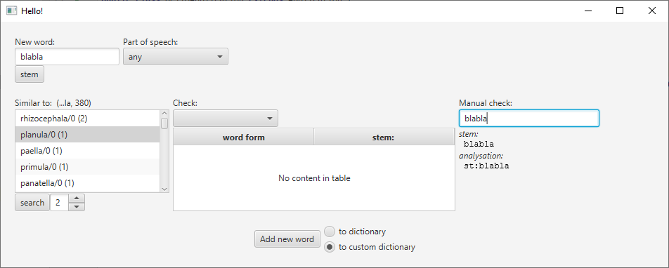
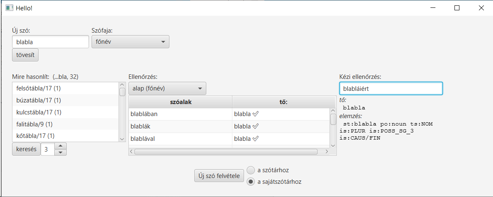

# hunspellEditor

A small utility for adding new words to hunspell.

It helps to find similar word (with the same part of speech and similar ending), and add it to its dictionary or custom dictionary.

screenshot in Hungarian:

